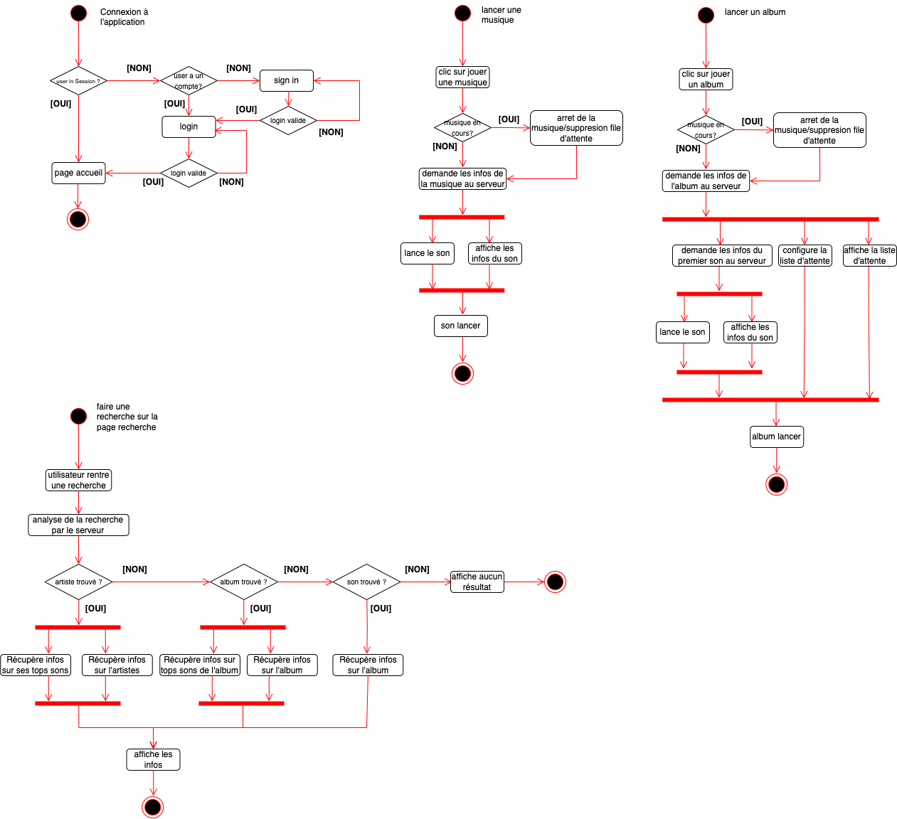

# SAE_WEB_BD

## GitHub

- [Lien du projet](https://github.com/Amaelmsrt/SAE_WEB_BD.git)

## Membre du groupe

- Chédeville Baptiste
- Gratade Sébastien
- Maserati Amael

## Professeur référent

- M. Dalaigre


## Lancement du serveur

Se mettre sur dans le fichier src :

``` bash
php -S localhost:8000
```

Si la base de données n'est pas configurée, voir la partie Configuration de la base de données.

## Configuration de la base de données 

Se mettrre à la racine du projet :

Création de la base de données :

``` bash
php src/cli.php sqlite db
```

Ajouter les tables :

``` bash
php src/cli.php sqlite c
```

Ajouter les données :

``` bash
php src/cli.php sqlite i
```

Supprimer les tables :

``` bash
php src/cli.php sqlite d
```

## Fonctionnalités

- Inscription / Login Utilisateur
- Playlist par utilisateur
- Favorie des musiques
- Possibilité de jouer une musique
- Possibilité de jouer un album
- Possibilité de jouer un artiste
- Possibilité d'ajouter une musique à une playlist
- Possibilité de supprimer une musique d'une playlist
- Possibilité d'ajouter une musique en liste d'attente
- Possibilité de mettre en pause une musique/ prochaine musique/ musique précédente
- Affichage des albums
- Détail des albums
- Détail d’un artiste avec ses albums
- Recherche avancée dans les albums/artistes/musiques
- Affichage des artistes

Partie admin :

- CRUD pour un album
- CRUD pour un artiste
- CRUD pour une musique
- CRUD pour un utilisateur
- CRUD pour une playlist


## Documentation

Les diagrammes UML sont dans le dossier "data" à la racine du projet.


Diagremme de classe :


MCD :


Diagramme d'activité :




Diagramme de séquence :


